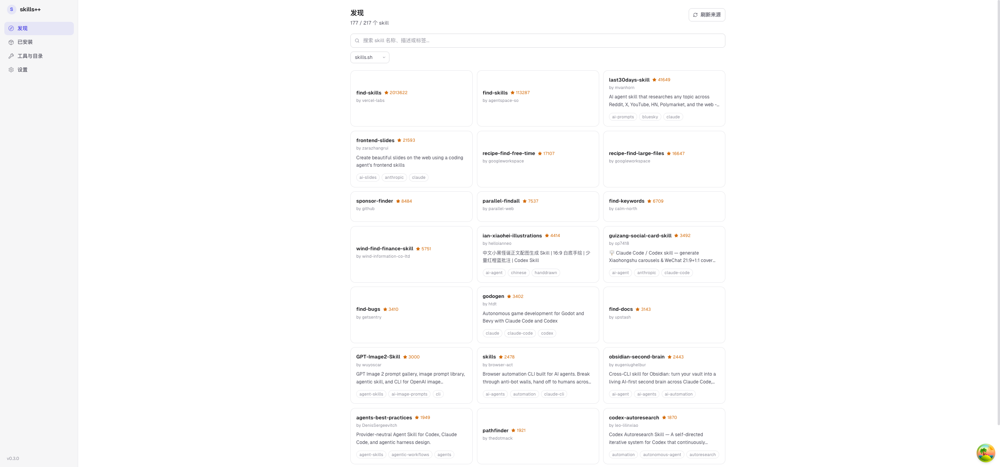
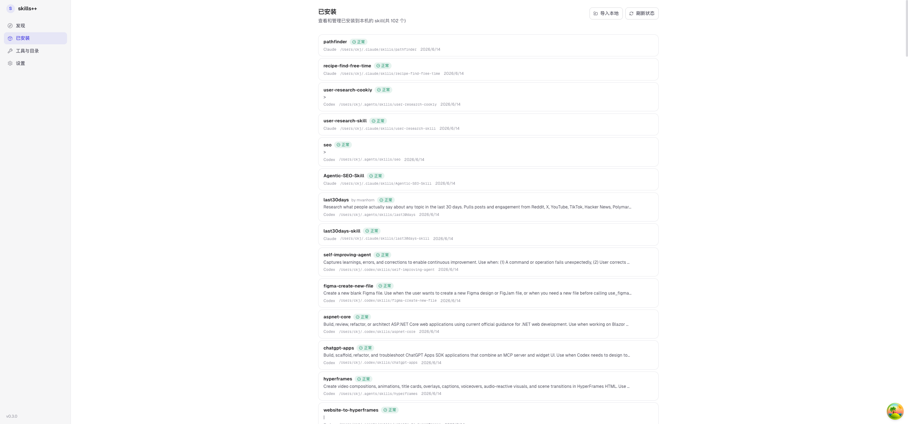
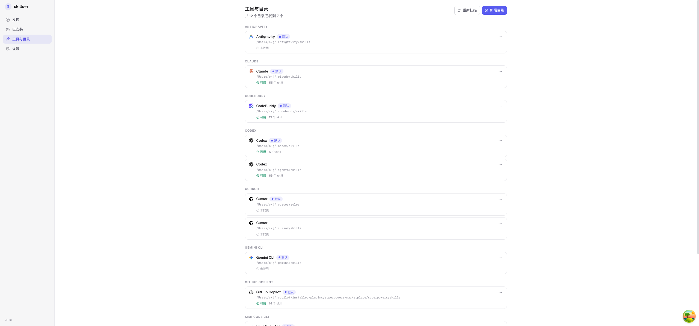
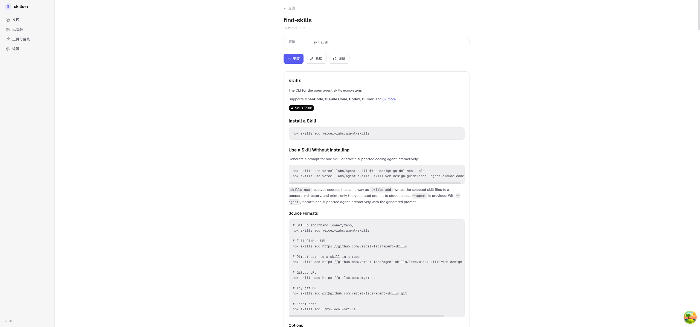
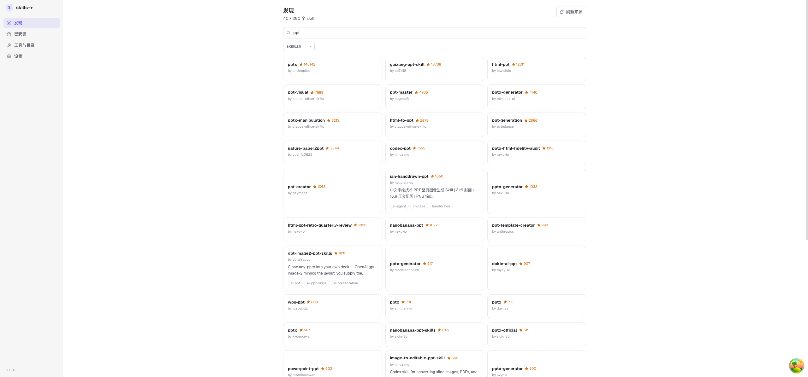

<div align="center">

# skills++

### Skills 安装与管理工具 — 汇总全网skills、一键安装

[](https://github.com/cpcc/SkillsPlusPlus/releases)
[](https://github.com/cpcc/SkillsPlusPlus/releases)
[](https://tauri.app/)

</div>

## 这玩意干啥的

Claude Code、Codex、Cursor、Gemini CLI 各有各的 skill 目录。想装同一个 skill？你得分别 git clone、复制目录、搞软链接。另外，像 Codex 这类提供界面的 AI 工具，自带的技能太少了，得自己搜索安装，烦。

skills++ 是个桌面应用，帮你干这些事。它从 skills.sh、LobeHub、SkillHub.cn 等地方聚合 skill 列表，自动识别本机已安装的 AI 工具目录，提供图形化的一键安装/卸载/重装能力。

## 截图

| 发现页 | 已安装管理 | 工具与目录 |
| :----: | :--------: | :--------: |
|  |  |  |

| 安装 Skill | Skill 详情 | 搜索 |
| :--------: | :--------: | :--: |
|  |  |  |

## 能干什么

### Skill 管理

- **多来源聚合** — 统一的发现页浏览 skills.sh、LobeHub 等来源站的 skill，支持搜索和筛选
- **一键安装** — 浏览详情、预览、选择安装到哪个AI、一键安装到目标 AI 工具目录
- **四种安装策略** — git 克隆 / 文件拷贝 / 压缩包解压 / 软链接（默认会自动选择）
- **SKILL.md 预览** — 安装前查看 SKILL.md 完整内容，了解 skill 功能
- **重装/卸载** — 右键菜单快速重装或卸载已安装 skill
- **更新检查** — 检测已安装 skill 是否有新版本
- **导入本地 skill** — 自动识别本机 AI 工具目录中的已有 skill，导入到管理列表

### skills目录管理

- **自动识别** — 自动扫描 Codex、Claude、Cursor、Gemini CLI、OpenCode、GitHub Copilot 等 10+ 工具目录
- **手动管理** — 新增/启用/禁用/删除目录
- **权限检测** — 自动检测目录读写权限

### 跨设备同步

- **本地导出/导入** — 一键将安装记录、目录配置、来源站开关和设置导出为 JSON 文件，在另一台设备导入即可同步，无需联网
- **WebDAV 云同步** — 配置 WebDAV 服务器后，点「立即同步」即可自动双向合并多设备数据，支持坚果云、Nextcloud、Synology 等
- **智能合并** — 三向合并算法自动处理冲突：两端都装的取较新的、一端新装的自动同步、远端已卸载的提示确认
- **自动同步** — 可选启动时自动同步 + 定时同步，多台设备始终保持一致

### 其他功能

- **主题切换** — 支持浅色/深色/跟随系统三种模式，Tauri 原生窗口主题同步
- **应用更新** — 自动检查 GitHub Releases 版本更新，一键下载最新版本
- **AI 品牌图标** — 未知工具自动生成 monogram 回退图标

## 怎么用

打开软件，去「工具与目录」确认 AI 工具目录识别对了。然后到「发现」页翻 skill，看到感兴趣的进去看详情，选择要安装到哪个AI工具目录。之后在「已安装」页面管它们。

多台设备想同步？去「设置 → 跨设备同步」：没有网络就用「导出配置」传文件，配了 WebDAV 就直接点「立即同步」自动合并。

## 下载

需要 Windows 10+、macOS 12+ 或 Linux（Ubuntu 22.04+ / Debian 11+ / Fedora 34+）。

从 [Releases](../../releases) 下最新版：
- Windows: `.msi`
- macOS: `.dmg`
- Linux: `.deb` / `.rpm` / `.AppImage`

或者 clone 项目自己跑：
```bash
git clone https://github.com/cpcc/SkillsPlusPlus.git
cd SkillsPlusPlus
pnpm install
pnpm dev
```

## 技术栈

| 层级 | 技术 |
|------|------|
| 桌面壳层 | Tauri 2.x |
| 前端框架 | React 19 + TypeScript 5.8 |
| 构建工具 | Vite 7 |
| 样式 | Tailwind CSS v4 + CSS 自定义属性（light/dark 双主题） |
| 组件库 | Radix UI（Dialog、DropdownMenu、Toast、Tooltip） |
| 状态管理 | TanStack Query v5 |
| 路由 | React Router v7 |
| 图标 | Lucide React + @lobehub/icons |
| Markdown | marked |
| 字体 | Geist Sans / Geist Mono |
| 后端 | Rust 2021 Edition |
| HTTP | reqwest 0.12 (async) |
| 数据库 | SQLite via rusqlite 0.31 |
| 测试 | Vitest + Testing Library + Playwright (E2E) |
| Monorepo | pnpm workspace |

## 开发

需要 Node.js 18+、pnpm 8+、Rust 1.85+、Tauri CLI 2.x。

```bash
pnpm install          # 装依赖
pnpm dev              # 跑起来
pnpm build            # 构建

# 类型检查
pnpm --filter desktop exec tsc --noEmit

# 前端测试
pnpm --filter desktop test:run

# E2E
pnpm --filter desktop test:e2e
pnpm --filter desktop test:e2e:ui

# Rust 侧
cargo check --manifest-path apps/desktop/src-tauri/Cargo.toml
cargo test --manifest-path apps/desktop/src-tauri/Cargo.toml --lib
```

<details>
<summary>架构和目录结构</summary>

### 分层

```
Commands → Services → Repositories → SQLite
```

前端通过 Tauri IPC 调 Rust 命令层，命令层调业务层，业务层调 SQLite。前端用 TanStack Query 管状态，mutation 完自动刷新。类型定义在 `packages/shared/` 两头共享，`invoke()` 调用有类型提示。

纯浏览器调试时自动切到 HTTP bridge，不用起 Tauri。

### 目录结构

```
├── apps/
│   └── desktop/                 # Tauri 桌面应用
│       ├── src/
│       │   ├── main.tsx
│       │   ├── App.tsx
│       │   ├── routes/          # 发现、详情、已安装、工具、设置
│       │   ├── components/      # AppShell、SideNav、Toast、安装对话框等
│       │   ├── hooks/           # React Query hooks
│       │   └── lib/             # IPC 封装
│       └── src-tauri/           # Rust 后端
│           └── src/
│               ├── commands/    # IPC 命令
│               ├── services/    # 业务逻辑（adapters、install 等）
│               ├── repositories/ # SQLite 数据访问
│               └── models/      # 数据模型
└── packages/
    └── shared/                  # 共享 TypeScript 类型
```

</details>

## 贡献

有 bug 或建议直接提 Issue。PR 前跑一下类型检查和测试。

## License

MIT
